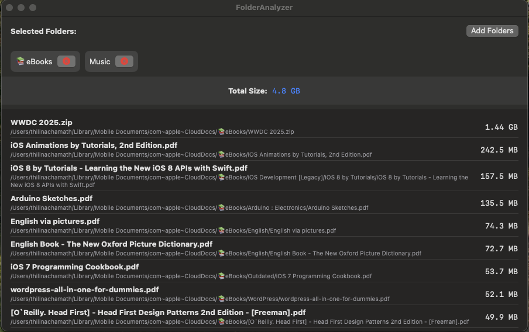

# FolderAnalyzer

A simple macOS application to analyze and visualize file sizes on your computer.

## Features 📋

- 📂 Select multiple folders to analyze
- 📊 View total size of selected folders
- 📝 See detailed file listings with sizes
- ⚡️ Real-time folder scanning
- ↕️ Sort files by size (largest to smallest)
- 🔍 View complete file paths
- 📈 Hierarchical file organization
- 🔒 Secure folder access using macOS security

## Requirements

- macOS 15.0 or later
- Xcode 16.0+ (for development)

## How to Use

1. Launch FolderAnalyzer
2. Click "Add Folders" to select folders
3. Grant permission when prompted
4. View folder sizes and file details
   - Files are automatically sorted by size (largest first)
   - Each file shows its full path and size in a readable format
5. Remove folders using the 'X' button

## Development

Built with:
- SwiftUI
- Combine Framework
- Swift 5.0

## License

MIT License - Feel free to use and modify

## Author

Thilina Chamath Hewagama

---

For bug reports and feature requests, please open an issue on GitHub.

